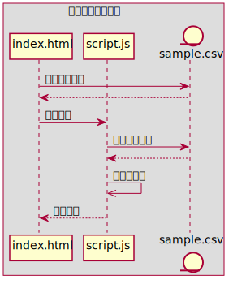
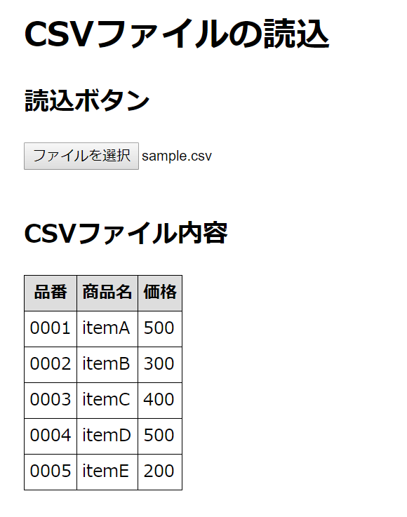

# 今回の授業内容

## 目的
プログラム開発を通して、アルゴリズムの考え方を学習します。

## 開発するプログラムの機能
次の機能を持つプログラムを開発します。
1. PC上のCSVファイルを参照する。
2. 参照したファイルの内容を読み込む。
3. 読み込んだ内容を画面に出力する。

## プログラムの構成
今回開発するプログラムの構成は、次のようになります。  


### index.html
読み込んだ「CSVファイル」の内容を出力する為のWeb画面を作成するためのファイルです。

### script.js
CSVファイルの内容を読み込んでWeb画面に出力するプログラムのファイルです。  
出力先の画面は「index.html」です。

### sample.csv
読み込み対象の「CSVファイル」です。
ファイルの内容は下記の通りです。
```sample.csv
0001,itemA,500
0002,itemB,300
0003,itemC,400
0004,itemD,500
0005,itemE,200
```

### 最終的な出力結果
今回作成するプログラムは、最終的に次の画面を出力します。
  
